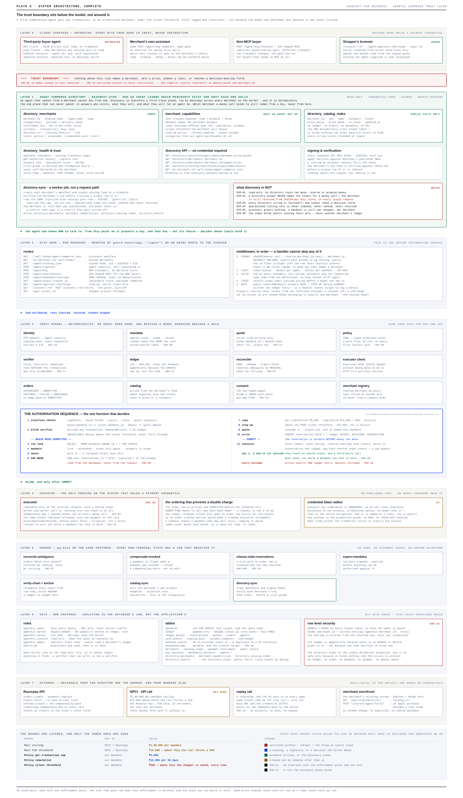
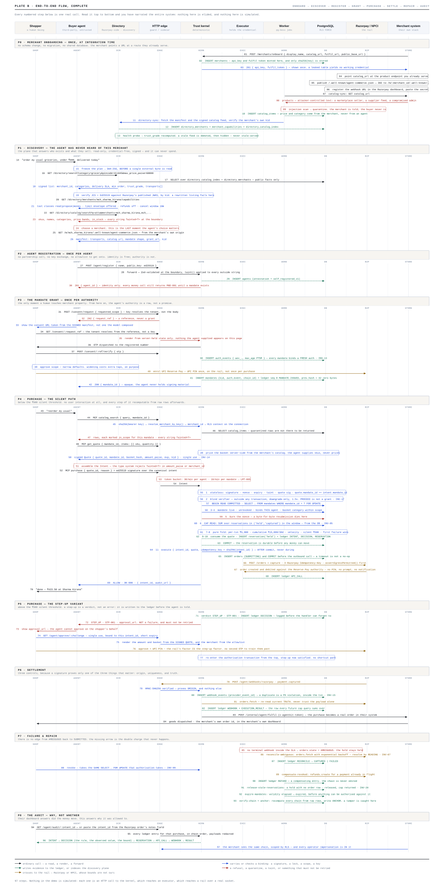

# AgentKit for Razorpay

**A trust layer for agentic commerce.** It lets any third-party AI agent buy from a
merchant, and makes it structurally impossible for that agent to move money on its own.

The trust boundary sits **below the model, not around it**. Nothing here tries to make an
AI safe. The design assumes the agent is already compromised — prompt-injected, jailbroken,
or simply wrong — and asks a different question: *what is the worst thing it can do?*

The answer is bounded by construction. A fully compromised agent gets one transaction, at
an allowlisted merchant, in an allowlisted category, under a cap a human set, below the
threshold that forces a human to look, recorded in an append-only ledger, and reversible.
Not because the model was defended. Because it was never trusted.

---

## The problem

An AI agent that shops for you needs to spend your money. Every existing answer is bad:

- **Give it your card.** Now a prompt injection is a blank cheque.
- **Give it an API key.** Same thing with extra steps — a key is a bearer credential.
- **Make it ask every time.** Then it is not an agent, it is a browser with extra latency.

The gap is that payments were designed for two parties who each know what they want. An
agent is a third party that *infers* what you want, and inference can be manipulated by
anyone who can get text in front of it — a product description, a review, a supplier feed.

AgentKit closes that gap by separating **proposing** from **authorising**. The agent
proposes. A kernel it cannot reach authorises. They never run in the same process, and the
one that can move money has no model in it at all.

---

## Architecture



Five services, one Postgres, strict separation of what each may hold.

| Service | Holds | Never holds |
|---|---|---|
| **kernel** | The policy engine, the ledger, the consent screen | A payment credential |
| **executor** | The Razorpay key. The only process that may. | Any model, any agent input |
| **worker** | Reconciliation, catalog sync, reservation reaping | A payment credential |
| **web** | Merchant dashboard and documentation. `SELECT`-only role. | Write access to anything |
| **storefront** | The merchant's own app. A MERN shop that knows nothing of mandates. | Any part of the kernel |

**INV-02** is the load-bearing one: *only the executor may hold a payment credential.* It is
enforced at boot — every other service calls `assertNoPaymentCredential()` and refuses to
start if one is present. A bug in the kernel cannot charge a card, because the kernel has
nothing to charge it with.

The kernel still needs to know what actually happened at the rail, so it reads provider
truth through a **read-only proxy rail** that can `fetch` and cannot `pay`. Ask it to create
a payment and it raises `RailIsReadOnlyError`.

---

## How a purchase works



```
agent → quote → intent (signed) → kernel authorises → executor pays → merchant fulfils
                                        ↑
                                   the only place
                                   money is decided
```

**1. Discovery.** An agent reads `/.well-known/agent-commerce.json` on the merchant's own
domain and learns the endpoints. No partnership call, no key exchange.

**2. Registration is identity, never authority.** The agent posts an Ed25519 public key and
gets an `agent_id`. It can now sign things. It can buy nothing — every money call is refused
with `MND-001` until a human grants a mandate.

**3. Consent is a human act.** The agent asks for permission and receives a *reference*,
never a permission. The shopper lands on the merchant's own origin, is identified there,
picks a delivery address, and is handed to the kernel's consent screen to approve limits and
enter a one-time code. Only then does a mandate exist.

**4. A quote is a signed price.** Prices come from the merchant, never from the caller. Each
quote names the mandate it was issued to (**INV-14**) and is single-use, so it cannot be
transferred between mandates or spent twice.

**5. The intent is signed.** The agent signs `SHA256` over RFC 8785 canonical bytes with its
Ed25519 key. Ten named fields, a closed set. Money is a decimal string, never a JSON number.

**6. The kernel decides.** Nineteen rules, in order, first failure wins. The verdict is
`ALLOW`, `DENY`, or `STEP_UP`.

**7. The executor pays.** It takes the amount from the *signed quote*, not the caller
(**INV-06**, zero tolerance). If a payment instrument is attached it auto-debits; if the rail
refuses that, the order stays payable and a human is handed a link.

**8. Fulfilment is idempotent.** The merchant's endpoint must be idempotent on `intent_id`,
because the kernel retries and a shopper must not get two orders.

---

## The policy engine

Nineteen checks, evaluated in order. The first failure decides the outcome and the rest are
not evaluated. Every rule writes what it *observed* and what it was *bound* against into the
ledger, so a decision can be re-read years later without reconstruction.

| # | Rule | What it prevents |
|---|---|---|
| 1 | `stateless` | Forged signatures, stale intents, quote/intent mismatch |
| 2 | `taint.decisionField` | Merchant-authored text reaching a field a rule reads |
| 3 | `agent.registered` | An unknown key spending |
| 4 | `verifier.objection` | A second opinion raising a flag |
| 5 | `verifier.availability` | Failing open when the verifier is down |
| 6 | `mandate.bindsAgent` | Agent A spending agent B's permission |
| 7 | `mandate.authEvent` | A mandate not traceable to a real human approval |
| 8 | `mandate.notRevoked` | Spending after revocation |
| 9 | `mandate.validity` | Spending outside the granted window |
| 10 | `scope.merchant` | Buying somewhere the shopper never allowed |
| 11 | `scope.category` | Groceries budget spent on electronics |
| 12 | `intent.nonceUnspent` | Replaying a signed intent |
| 13 | `quote.unconsumed` | Spending one price twice |
| 14 | `quote.notExpired` | Holding a stale price |
| 15 | `limits.perTransaction` | One large purchase |
| 16 | `limits.cumulative` | Many small ones |
| 17 | `limits.velocity` | A burst |
| 18 | `stepUp.silentThreshold` | Large spend passing without a human |
| 19 | `stepUp.firstAtMerchant` | A first purchase somewhere new passing silently |

Failures produce one of **26 stable reason codes** — `MND-001`, `CAP-001`, `SCP-002`,
`STP-002` — which read identically in the API, the ledger and the dashboard.

**A step-up is not a refusal.** It is a question. The purchase pauses, a human approves, and
their approval is written as a *second decision* on the same intent. Both are in the record.

**Fail closed (INV-08).** The rule fold's default arm denies, so an unrecognised state
refuses rather than allows.

---

## Where the security actually lives

### Money is held, not counted

The cap sums **reservations** in `('held','captured')`, not settled payments (**INV-05**).
Counting only settled payments is the classic double-spend hole: two concurrent purchases
both read a spent total that excludes the other.

The read happens under `SELECT … FOR UPDATE` on the mandate row at `READ COMMITTED`, so two
authorisations of the same mandate serialise against each other. Every reservation is
eventually resolved — captured, released, or reaped (**INV-20**).

### No network calls while holding the lock

**INV-19.** An egress guard backed by `AsyncLocalStorage` is armed while the mandate row lock
is held, and every HTTP client calls `assertEgressPermitted` before opening a socket. A slow
third party cannot hold a lock that blocks a shopper's checkout.

### The ledger is append-only and self-verifying

One hash chain per mandate:

```
hash = SHA256( prev_hash ‖ JCS(payload) )
```

`UPDATE`, `DELETE` and `TRUNCATE` are revoked on the ledger for **every application role**
(**INV-11**), and a unique constraint on `(chain_id, prev_hash)` makes a second branch
physically unwritable — you cannot fork a chain even with SQL access.

Editing a row and its hash column together still fails, because the next entry committed to
the old value. Verification recomputes every hash from raw rows rather than comparing stored
ones, so a row edited in place is caught. You can watch it happen: every decision page has a
**Verify the chain** view that recomputes the arithmetic in the browser and shows the
canonical bytes it hashed.

### Tenant isolation is the database's job, not the code's

**INV-21.** Forced row-level security on **13 of 23 tables**, scoped by
`current_setting('agentkit.merchant_id')`. The context is set and then *read back and
verified* before any query runs. Five separate Postgres roles — `owner`, `kernel`, `worker`,
`console`, `admin` — each with the narrowest grants that let it do its job.

A bug in application code cannot leak another merchant's data, because the code is not what
is enforcing the boundary.

### Untrusted text can never become an instruction

**INV-12.** Catalog content is attacker-controllable — a marketplace seller, a compromised
admin, a supplier feed. Every string from the merchant comes back branded `Tainted<T>`, a
type that cannot reach a field a decision reads. Product records are scanned for injection
patterns at sync time and quarantined if they match.

**INV-01:** no model output is ever executed. The authorisation function takes an intent and
a quote. There is no code path from generated text to a decision.

### Two credentials, two doors

| Credential | Header | Who holds it | Opens |
|---|---|---|---|
| API key `ak_…` | `x-agentkit-key` | The agent | Catalog, quotes, checkout, orders |
| Fulfil token `aft_…` | `x-agentkit-token` | The merchant's backend | Binding consent to a real customer |

Both stored SHA-256 only. Presenting one at the other's door fails as though it were never
issued, and a wrong credential is refused *identically* to a missing one — otherwise the
endpoint becomes an oracle for guessing keys.

The authorisation handoff is signed with the **hash** of the fulfil token, so the kernel can
verify a merchant's statement without ever holding their token in recoverable form, and each
merchant has a distinct signing key.

### The shopper is asked the one question only they can answer

The kernel cannot prove that customer id `cus_101` is the person on the screen — that id
belongs to the merchant's namespace and is opaque. So it does not try. The merchant's signed
handoff carries a display name and address which the consent screen **renders and never
stores**, and the shopper declines if it is not theirs. The one party who can check is asked
to.

### A webhook is a notification, never an instruction

**INV-15.** A correctly signed `payment.captured` does not settle anything. The kernel goes
and asks the provider what actually happened, and refuses the claim if the provider
disagrees. This is verified in the live deployment: a valid signature for an unpaid order was
refused, with `confirmed_by: orders.fetch` in the ledger.

### Ambiguity is never resolved by guessing

**INV-07.** A rail timeout means nobody knows which side of the network the money is on. That
order becomes `AMBIGUOUS`, and there is deliberately **no path back to `SUBMITTED`**. It is
resolved by *reading* the provider, never by retrying and hoping.

### Idempotency everywhere money moves

**INV-04.** The key is `SHA256(intent_id)` — deterministic, so a replayed intent produces the
same key and the rail collapses it. Razorpay's Orders API ignores idempotency headers, so the
executor **measured that** and recovers by searching for the existing order rather than
re-creating it.

---

## Three ways in, one gate

All three transports funnel into the same `authorize()`. One decision path, three doors.

| Transport | Endpoint | For |
|---|---|---|
| **MCP** | `POST /agent/mcp` | Claude Desktop and any MCP client, over Streamable HTTP |
| **ACP** | `POST /agent/acp/checkout` | Agentic commerce protocol clients |
| **HTTP** | `POST /agent/quote`, `/agent/register`, … | Anything else |

The tool surface is **11 tools**, each carrying a permission `class` that is configuration
rather than documentation:

- **read** (7) — costs nothing, always available: catalog, order history, budget, consent status
- **propose** (2) — costs nothing, because a proposal is only words: `quote`, `orders.reorder`
- **money** (2) — spends the shopper's money, always through the policy engine: `purchase`, `orders.cancel`

A fourth class, **margin**, is defined for tools that spend the *merchant's* money rather
than the shopper's — a discount, a promo — bounded by a separate budget. No tool uses it yet.

The list can grow without the blast radius growing with it, because a new read tool is still
only a read.

For MCP sessions the **kernel signs on the agent's behalf** — an MCP client cannot hold a
signing key — and that signature proves which agent asked while granting nothing the mandate
had not already granted.

---

## What a merchant actually does

Four URLs and a key. Nothing about the existing shop changes.

```js
const { AgentKit } = require("@agentkit/merchant");

const kit = new AgentKit({
  baseUrl: "https://kernel.yourshop.in",
  apiKey: process.env.AGENTKIT_API_KEY,
});

const signedQuote = await kit.quote({ mandateId, items: [{ sku, quantity: 1 }] });
const decision = await kit.agent({ agentId, privateKey })
  .checkout({ mandateId, signedQuote, rationale: "weekly staples" });
```

Three integration paths, depending on how much the merchant wants to write:

| Path | Effort |
|---|---|
| **Node SDK** — `@agentkit/merchant` | `npm install`, four calls |
| **Python SDK** — `agentkit-merchant` | `pip install`, same surface |
| **Docker adapter** — `@agentkit/adapter` | No code. Point it at your existing product/order/session endpoints and map field names. |

The SDKs exist because three details are unforgiving and all three fail the same way — the
kernel answers `INT-001` and deliberately says no more, because a signature check that
explained itself would be an oracle for forging one:

1. **Canonical JSON.** Signatures cover RFC 8785 bytes: key order, escaping, number format.
2. **Money is a string.** Paise exceed float precision before they exceed a realistic basket.
3. **The signing payload is a closed set.** Ten fields for an intent, nine for a quote.

Both SDKs are tested **byte-for-byte against the kernel's own implementation**, and against
each other, so they cannot drift.

---

## Verified, not asserted

Every claim above is exercised by a test or was observed on the live deployment.

```
kernel + integration      218 passing
Node SDK                   30 passing
Docker adapter             18 passing
Python SDK                 11 passing
                          ───
                          277
```

Running against real Razorpay on a real domain:

- A complete agentic purchase: agent proposed → policy engine returned `STEP_UP` on
  `stepUp.firstAtMerchant` → human approved → captured → reconciled by reading the provider.
- A correctly signed webhook claiming capture **refused**, because provider truth said unpaid.
- Multi-tenancy: a newly onboarded merchant sees zero of the seeded merchant's 20 mandates.
- Chain verification over 26 live entries: every hash and every link recomputes.

**23 invariants**, each one testable and named in the code that upholds it.

---

## Running it

```bash
docker compose up -d      # seeded, no accounts, no keys, RAIL=replay moves no money
```

**INV-22:** `docker compose up` on a machine with no accounts and no keys reaches a seeded,
working system. Production deployment — TLS, secrets, per-merchant configuration — is in
[`deploy/README.md`](deploy/README.md).

---

## An honest limitation

Fully autonomous payment — charging without a human present — requires a tokenised payment
instrument on the mandate. The architecture supports it end to end, and the executor attempts
it whenever an instrument is attached.

In practice **every card token minted in our Razorpay test account came back `status: failed`**
despite the ₹1 registration capturing successfully, and `payments/create/recurring` refused
every subsequent debit. This is reproduced on live infrastructure and raised with Razorpay
support (ticket #20682804).

The system degrades honestly rather than pretending: when the rail refuses an auto-debit the
order stays payable and the shopper is handed a link, and everything downstream — capture,
reconciliation, fulfilment, receipt — proceeds normally. The policy engine, the mandate, the
ledger and the audit trail are unaffected either way.

---

<p align="center">
  <br>
  
  <br><br>
  <sub>Built for the Razorpay hackathon — Track 01, AI Growth &amp; Agentic Commerce</sub>
</p>
